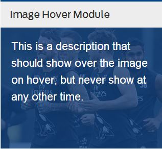

# [FOX SPORTS Australia](http://www.foxsports.com.au)

## Welcome to the Web Front End Team test

### Introduction

In this test, we are looking at your ability to write elegant, efficient and semantically correct JavaScript and CSS code.

### Hints

* Be aware that Chrome can't deal with local json files, so task 2 won't work in Chrome unless you are running it through a local webserver.
* jQuery is available to use if needed, although consider if it's required for the task

### Rules

Do
* Please write your code in functional/prototype JavaScript that will work in modern browsers.
* Place your code in the provided `script.js` and `style.css` files in the __root__ of this project.
* If transpiling, please include your source files.
* Submit your answer to the repo.

Dont
* Waste too much time on tooling or build processes. It's not required to pass this test.
* Alter the `style.css` file in the __css__ directory any way.
* Alter the raw HTML markup in `index.html`.
* Spend longer than 2 hours on the test. It's not timed, but its intended to be a simple test.

### Tasks

There are 2 parts to this test:

* [image-hover-module](#image-module)
* [json-module](#json-module)

#### Image Hover Module

* On page load, it should look like:

  

* When the user hovers over the image, the "hover-text" div should display with white text on a blue transparent background, fitting exactly over the image - like this:

  

* When the mouse leaves the image hover-text, it should go back to just the image displaying.

#### JSON Module

* Fetch the contents of the JSON [players.json](data/players.json) and [stats.json](data/stats.json)
* The purpose of the table is to show player stats. If a player does not have stats, don't show them.
* Parse the JSON files and display their data using a table as shown below, using the `short_name`, `matches`, and `tries` fields.

  
